# Voyant 完整业务操作手册(新手版)

> 适用对象:第一次使用 Voyant 的运营/销售/财务人员。
> 系统登录:浏览器打开你的部署地址 → 输入账号密码(演示账号
> `owner@voyant.dev / password123`)→ 右下角用户菜单可切换「中文」。
> 系统里已预置一套中文演示数据(华东旅运供应商、华东五市经典 6 日游、
> 长江三峡邮轮、张伟/王芳客户、两笔演示订单),你可以拿它们放心练手。

> **关于截图**:本手册中的截图摄于 https://47.236.18.118.sslip.io 的演示环境,界面随版本更新可能略有差异。
> 各业务场景的全景流程可参见配套《业务操作流程图》(在线流程图)。

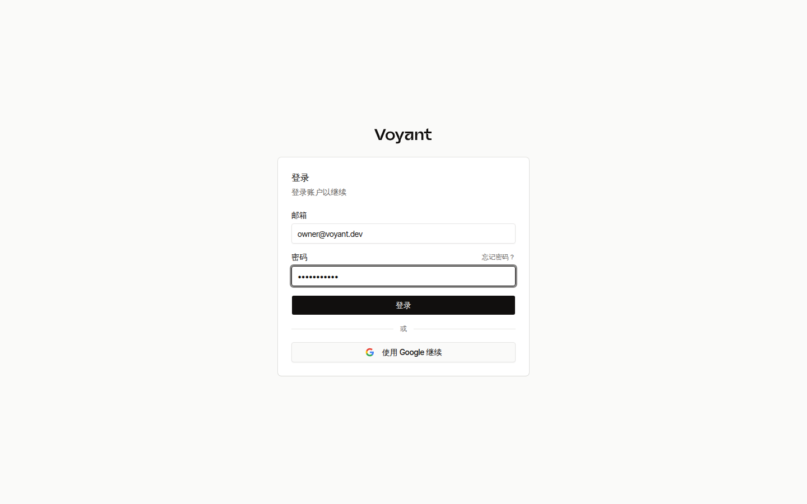
*图:Voyant 登录页。输入演示账号密码即可进入系统。*

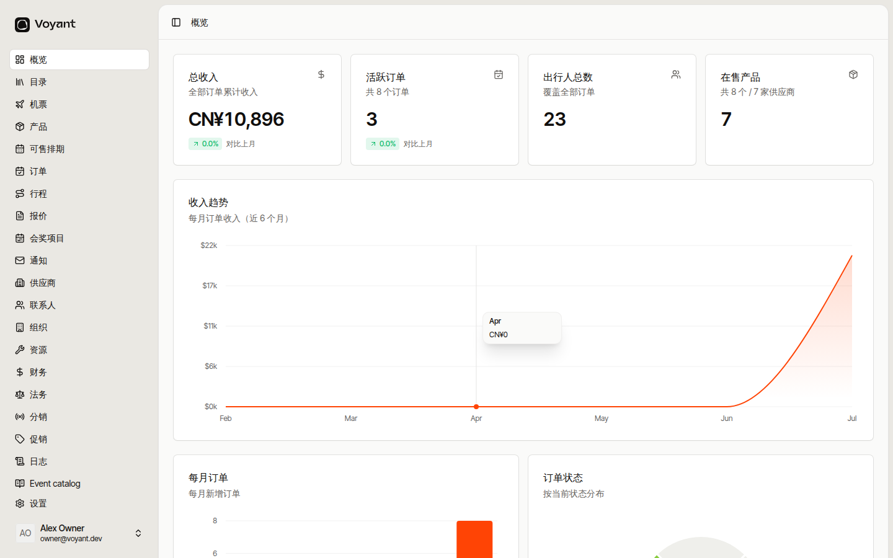
*图:登录后的「概览」工作台,汇总关键业务指标,是每天工作的起点。*

---

## 〇、先弄懂 6 个核心概念(5 分钟)

Voyant 的所有业务都沿着一条「承诺阶梯」推进,每走一步,承诺就更硬一分:

```
报价(Quote) → 报价版本(Quote Version) → 客户接受 → 预留(Hold) → 订单(Booking) → 履约(Fulfillment)
```

| 概念 | 一句话解释 |
| --- | --- |
| **客户(Person)/ 组织(Organization)** | 一切生意的起点。个人客户建「人员」,企业客户建「组织」,一个人可以属于多个组织。 |
| **产品(Product)** | 你卖的东西:跟团游、一日游、包价行程等。产品下有「选项」(如中文团/英文团)和「计价单元」(如成人/儿童)。 |
| **班期(Slot)** | 产品某一天(或某个时刻)的具体可售库存,带剩余名额。由「可用性规则」批量生成。注意:**班期 ≠ 团期**,团期(Operated Group Departure)指带车辆/导游/房单的固定发团实例。 |
| **报价(Quote)** | 一次销售跟进。给客户的每一版方案叫「报价版本」,发出后不可改,要改就出新版本。 |
| **订单(Booking)** | 客户接受报价、库存预留成功后生成的正式承诺记录,挂着旅客、订单项、占位(Allocation)、付款计划。 |
| **账单(Invoice)** | 财务开给付款人的收款文书,生命周期:草稿 → 已发送 → 部分收款/已收款/逾期/作废。 |

三个容易混淆的钱:**成本(Cost)**=付给供应商的钱;**费率(Rate)**=供应商报的单价;**售价(Price)**=客户付的钱。

三个容易混淆的库存词:**切位(Allotment)**=切给某个渠道的库存块;**占位(Allocation)**=订单项对库存的占用(held→confirmed→fulfilled);**预留(Hold)**=下单前的限时锁位,到期自动释放。

---

## 一、开业准备:首次配置(管理员做一次)

> 菜单位置:左侧导航「设置」。

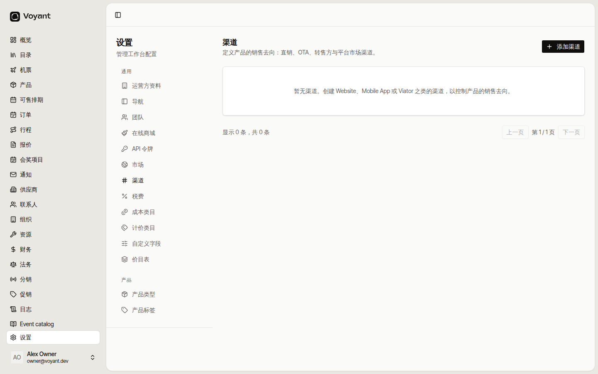
*图:「设置」总览页,开业前的各项基础配置都从这里进入。*

1. **市场(Market)**:设置 → 市场 → 新建。填名称(如「中国大陆」)、货币 `CNY`、时区 `Asia/Shanghai`。市场决定客户看到的币种与定价口径。演示数据已建好 CN 市场。

   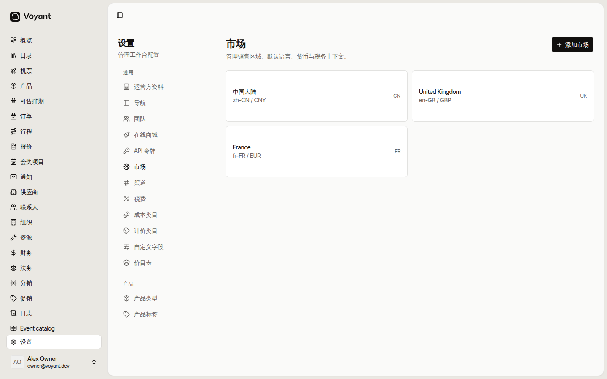
   *图:市场设置页,演示环境已预置好 CN 市场(CNY / Asia/Shanghai)。*

2. **供应商(Supplier)**:设置/分销 → 供应商 → 新建。填名称、联系人、结算币种。你直接采购服务的地接社、车队、酒店都建成供应商。

   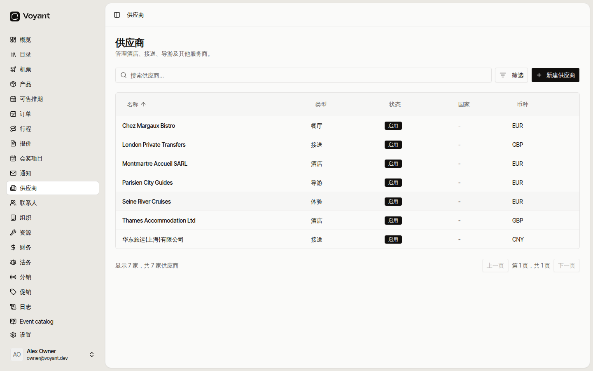
   *图:供应商列表,演示数据中的「华东旅运」即为一家已建好的供应商。*

3. **取消政策(Cancellation Policy)**:设置 → 政策 → 新建取消政策。按「距出行 X 天,退 Y%」逐档填写,保存后发布版本。之后挂到产品上。
4. **文书模板**:
   - 合同模板(法务模块):系统已内置中文《旅游服务合同》模板(travel-services-contract-zh);
   - 账单/确认函/收款收据模板(财务与通知模块):已内置 invoice-zh-cn、booking-confirmation-zh、payment-receipt-zh。
   - 需要改抬头、条款时,在对应模块的「模板」页复制一份再编辑。

   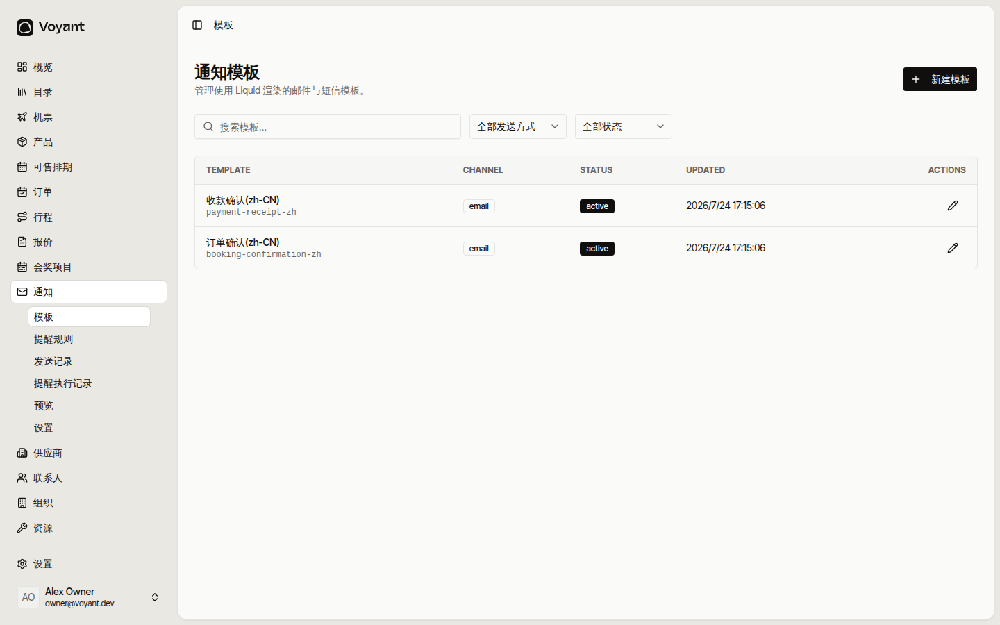
   *图:通知模板页,可以看到已内置的中文模板(确认函、收款收据等)。*

5. **团队账号**:设置 → 用户/邀请,给同事开账号并分配角色(销售、运营、财务)。
6. **收款方式**:财务设置里配置银行转账信息(收款人/账号),有线上收款需求再接支付网关。

除上述必做项外,设置中心还提供税费、自定义字段等更多配置,按需启用即可:

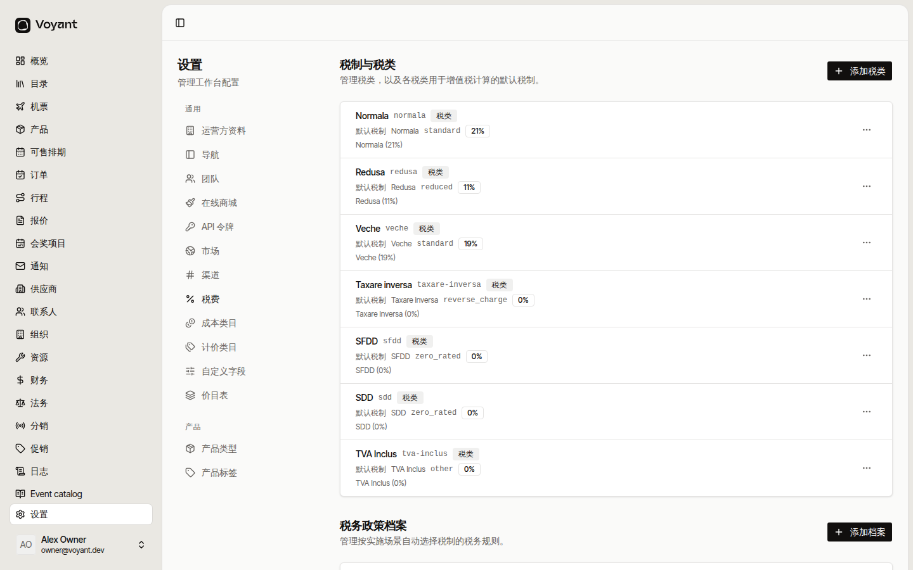
*图:税费设置页,用于配置税率与含税/不含税口径。*

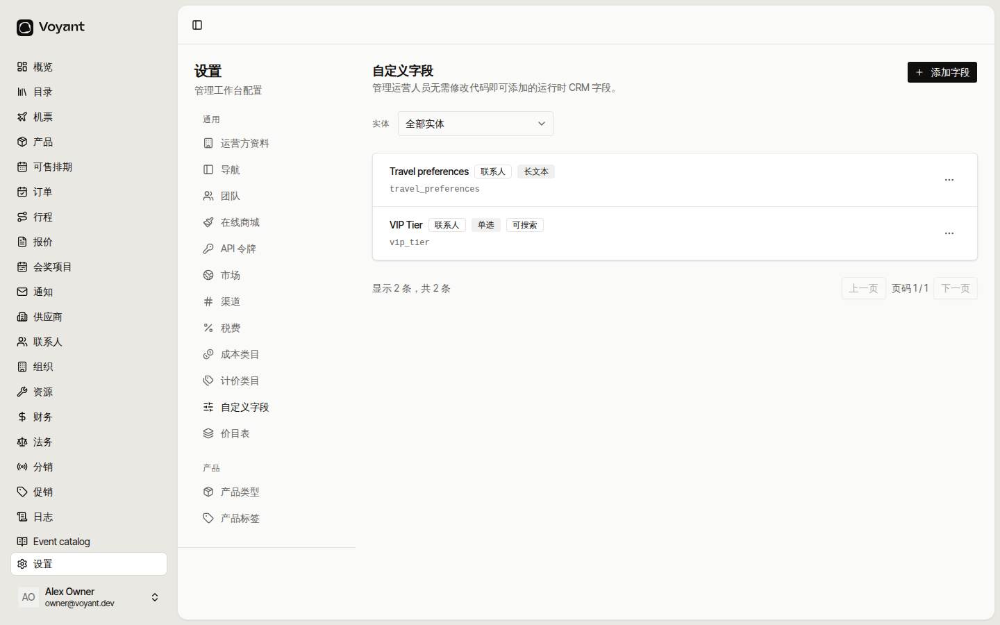
*图:自定义字段设置页,可为客户、订单等对象扩展业务字段。*

✅ 自查:市场、至少 1 个供应商、1 套取消政策、模板可用、同事能登录 —— 即可开始接单。

---

## 二、场景 A:跟团游/自营产品 —— 从建品到收款的完整闭环

这是最核心的主流程,吃透它,其他场景都是变体。

### 第 1 步:建产品(运营)

菜单:产品 → 新建产品。

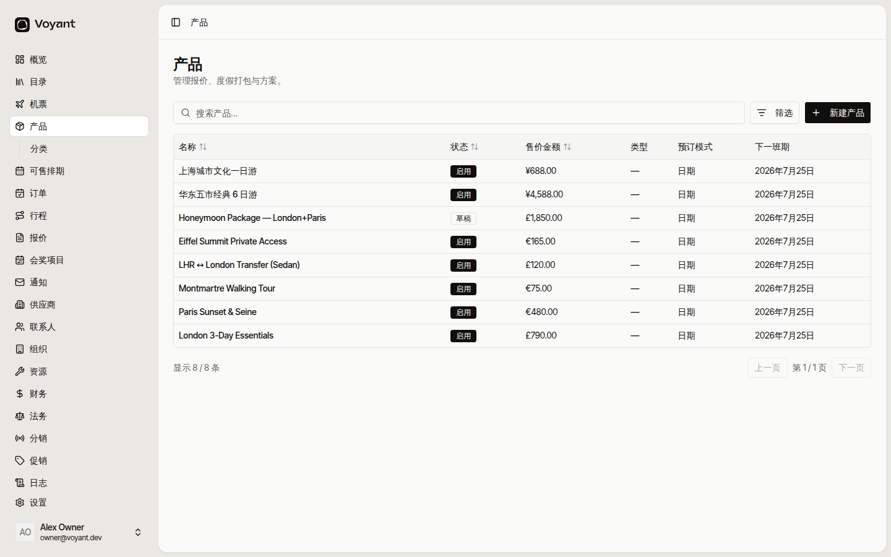
*图:产品列表页,演示数据中已有「华东五市经典 6 日游」等产品。*

1. 填基本信息:名称(如「华东五市经典 6 日游」)、预订模式选「按日期」、容量模式、可见性(上架/隐藏)。
2. 编辑行程:逐天添加「行程日」,每天挂「当日服务」(接送、用餐、导览、住宿引用)。
3. 添加选项与计价单元:选项如「标准团/纯玩团」;每个选项下建单元「成人」「儿童(3–11)」等。
4. 上传图片、填亮点与费用包含/不含说明。

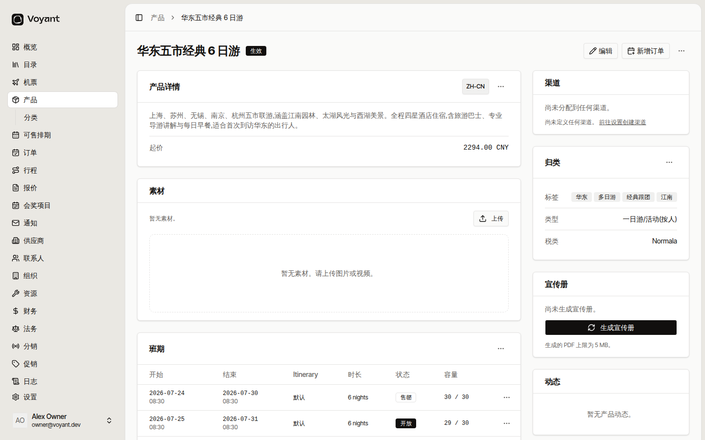
*图:「华东五市经典 6 日游」产品详情页,包含基本信息、选项与计价单元等。*

### 第 2 步:定价(运营/商务)

菜单:产品详情 → 价格,或定价模块。

1. 选择市场(中国大陆/CNY)。
2. 为每个计价单元填**售价**;如需核算毛利,同时录入供应商**费率**与**成本**。
3. 有淡旺季就建多个「价格时段」(如 7–8 月暑期价、其余平季价),写清生效起止日期。

### 第 3 步:排班期(运营)

菜单:产品详情 → 可用性/班期。

1. 新建「可用性规则」:如「每周二、六发团,容量 40,有效期 3 月–11 月」。系统按规则自动生成一个个具体**班期**。
2. 特殊日期用「关闭(Closeout)」屏蔽:节假日不发团、检修日、手工售罄都用它。
3. 检查班期日历:每个班期显示日期与剩余名额。

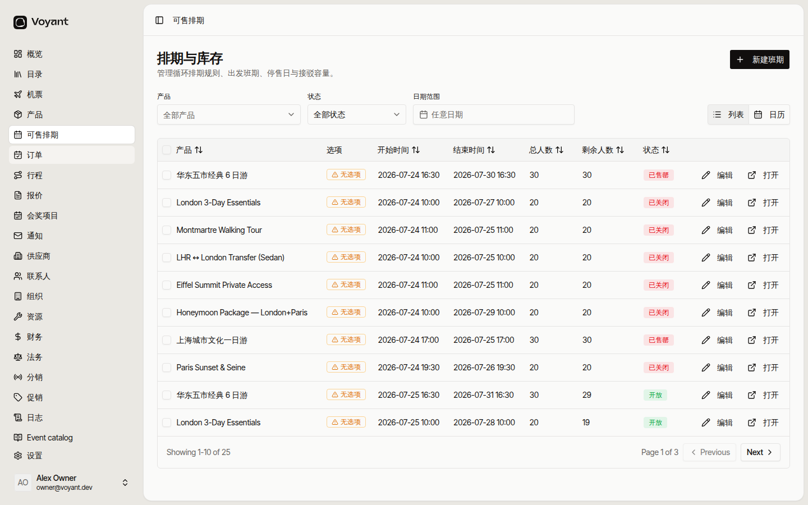
*图:排期页的班期日历,每个班期显示日期与剩余名额。*

### 第 4 步:客户建档(销售)

菜单:客户(人员/组织)。

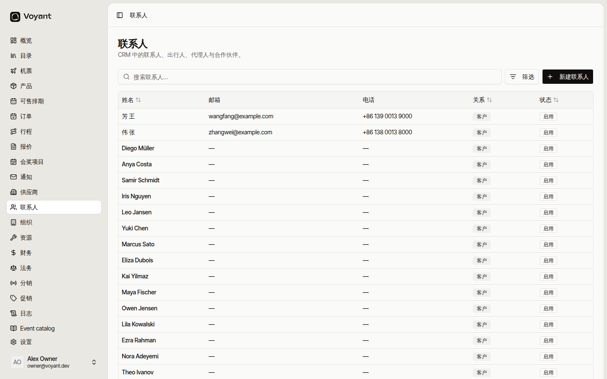
*图:客户列表页,演示数据中已有王芳、张伟等客户档案。*

1. 新建人员:姓名、手机、邮箱、证件信息(证件属敏感信息,系统会审计记录)。

   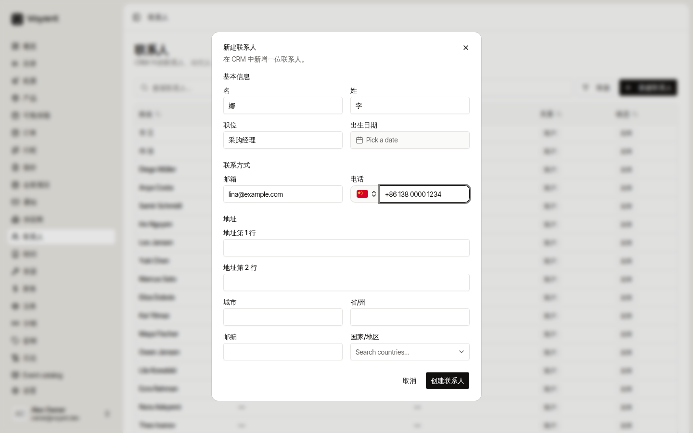
   *图:新建联系人对话框,以录入客户「李娜」为例填写姓名、手机、邮箱等。*

   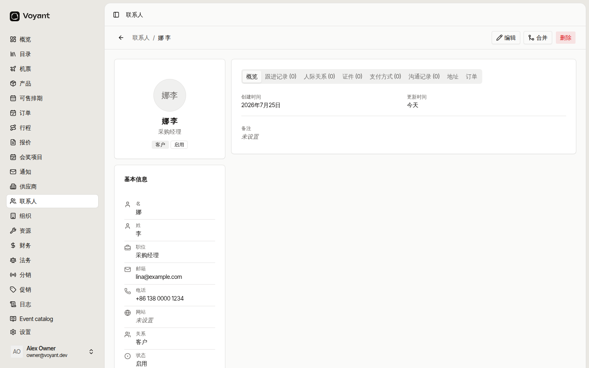
   *图:保存后的客户详情页(李娜),后续报价、订单都会挂在这份档案下。*

2. 企业客户先建组织,再把联系人挂进去。

   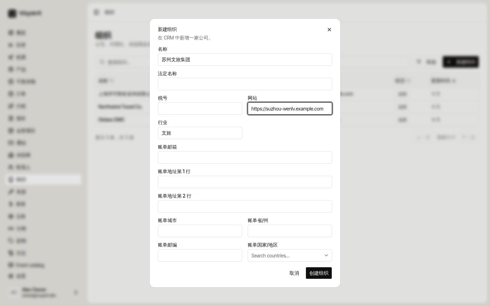
   *图:新建组织对话框,以录入企业客户「苏州文旅集团」为例。*

### 第 5 步:报价(销售)

菜单:报价 → 新建。

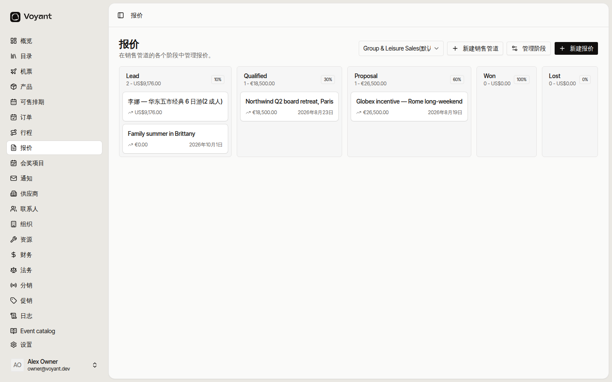
*图:报价看板,按销售管道阶段分列展示各报价卡片。*

1. 选客户(人员或组织),报价进入销售管道的第一个阶段(如「已确认需求」)。

   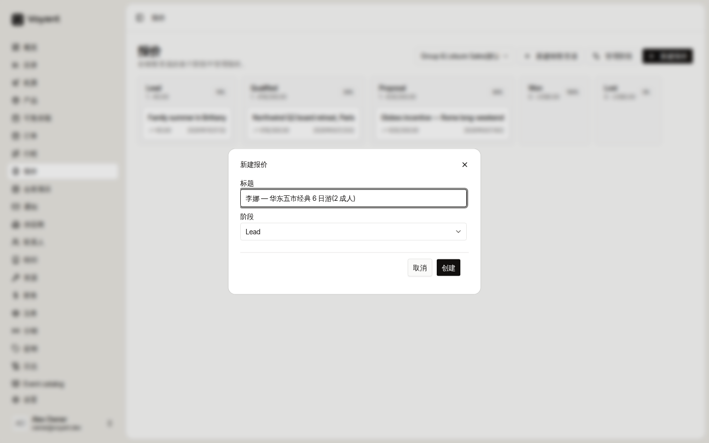
   *图:新建报价对话框,先选择客户与基本信息。*

2. 组行程:把产品、日期(选具体班期)、人数(成人 2 儿童 1)加进方案,系统按价格时段自动算价,可手工调整或加折扣。

   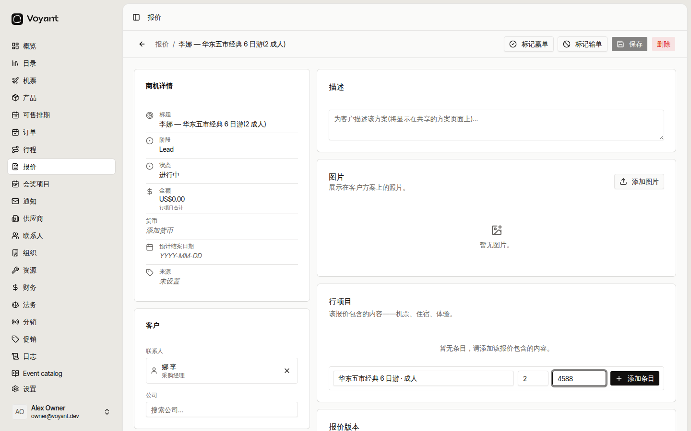
   *图:报价填写界面,选定客户后逐条添加产品、班期与人数条目。*

3. 生成**报价版本**并发送给客户(邮件/导出 PDF)。客户要改?→ 直接出「版本 2」,旧版本保留可追溯。

   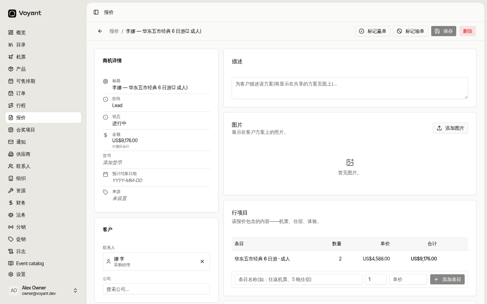
   *图:报价详情页,可以看到方案条目、金额与版本信息。*

   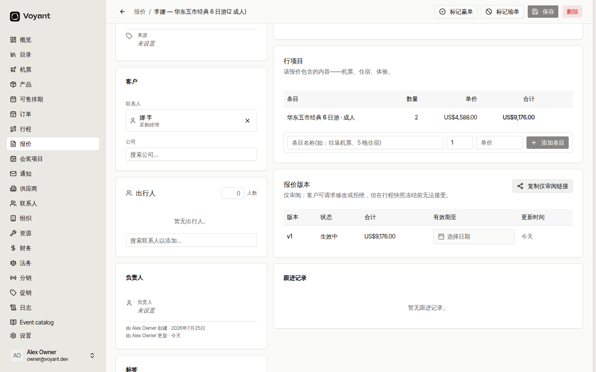
   *图:报价版本发送审阅后的状态,已发出的版本被冻结、不可再改。*

4. 在报价页记录跟进「活动」:打过的电话、谈判要点、待办。
5. 客户点头 → 在系统里把该版本标记「接受」。报价即关闭为「赢单」。

### 第 6 步:接受 → 预留 → 订单(销售/运营)

关键理解:**客户接受 ≠ 库存到手**。接受后系统发起「预留流程」:

1. 系统对方案里的每个组件核对可售性(班期余位、价格是否仍有效)。
2. 余位锁定为限时**预留(Hold)**;需要供应商人工确认的组件,转入「待供应商确认」。
3. 全部组件落定 → 生成**订单(Booking)**,订单号如 `VYT-CN-2026-00001`;班期余位被正式**占位(confirmed)**。
4. 补录旅客名单:每位出行人的姓名、证件、类别(成人/儿童),从客户档案带入或新录。

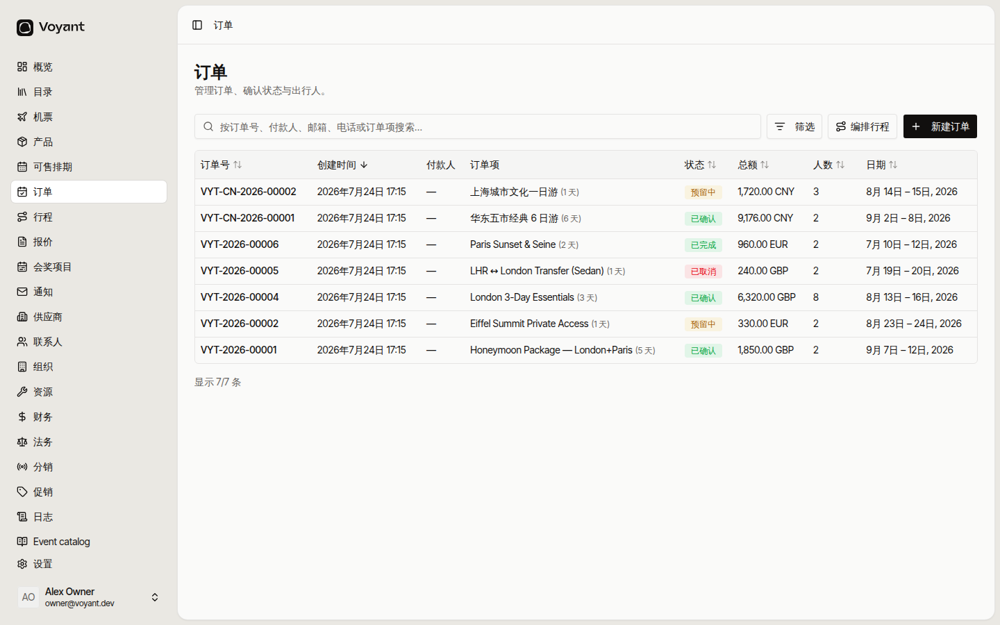
*图:订单列表页,预留成功后新订单会出现在这里。*

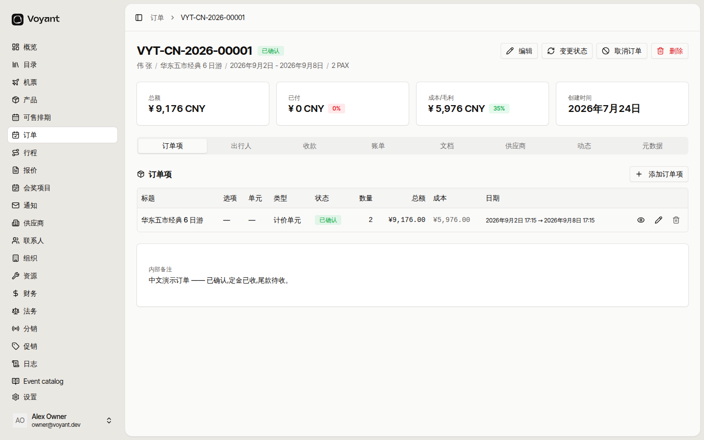
*图:订单详情页(VYT-CN-2026-00001),挂着旅客、订单项、占位与付款计划。*

### 第 7 步:收款(财务)

菜单:订单详情 → 付款/账单;或财务模块。

1. 建「付款计划」:定金(如 30%,下单 3 日内)+ 尾款(出行前 30 天),各行写明到期日。
2. 开**账单**:从订单生成,选中文模板(invoice-zh-cn),核对抬头、明细、税率后由「草稿」→「发送」。

   
   *图:账单列表页,可按状态(草稿/已发送/已收款/逾期)筛选。*

3. 客户付款后录「收款(Payment)」:方式(银行转账/刷卡/现金)、金额、日期,勾对应账单。账单状态自动变「部分收款」或「已收款」。

   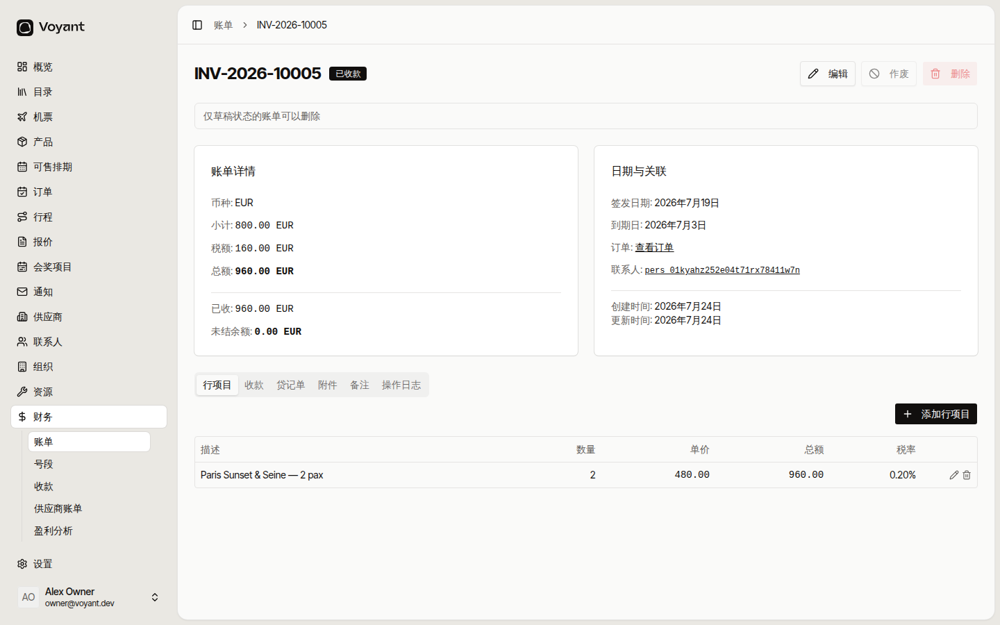
   *图:账单详情页(INV-2026-10005),包含抬头、明细与收款记录。*

4. 逾期未付,账单自动标「逾期」,催收后补录。

### 第 8 步:签合同(销售/法务)

菜单:法务/合同,或订单详情 → 合同。

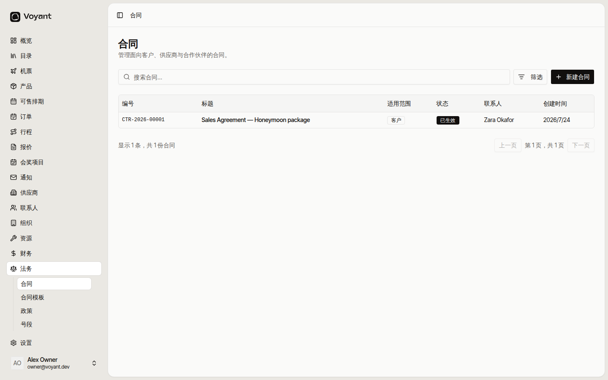
*图:法务模块的合同页,内置中文《旅游服务合同》模板可直接取用。*

1. 从中文合同模板生成合同实例,变量(客户名、行程、金额)自动填充。
2. 发给客户签署,系统记录「签署」(签署人、方式、时间)。
3. 同时记录「政策接受」:客户确认过哪一版取消政策,留痕备查。

### 第 9 步:出单与出团(运营)

1. **出单(Issue)**:订单项生成履约凭证——服务凭证/电子票(PDF/二维码),再**送达(Deliver)**给客户(邮件/下载)。
2. **出团准备**:
   - 排车与司机:运营 → 派遣(Dispatch),指定车辆、司机、集合点;
   - 排导游:资源池里选空闲导游指派;
   - 住宿:整理房单(Rooming List),旅客分房;
   - 打印出团通知书发客户。
3. 出行日:订单状态「开始」;导游现场**核销(Redeem)**凭证(扫码/人工签到)。
4. 行程结束:订单标「完成」,占位变 fulfilled。

### 第 10 步:售后与退改(全员)

- **客户要取消**:订单上执行「取消(Cancel)」→ 系统按取消政策算应退比例 → 财务处理:未收款的账单直接「作废(Void)」;已收款的开**信用单(红字/Credit Note)**并退款。记住口诀:**订单用取消,账单用作废,赢单叫关闭**——三个动作别混。
- **改期**:未确认前改报价版本;已成订单则调整订单项/占位到新班期(余位允许时)。
- **异常兜底**:管理员可「强制改状态(Override)」,必须填原因,系统全程审计。

---

## 三、场景 B:邮轮销售

菜单:邮轮模块。与场景 A 的差别只在「货」不同:

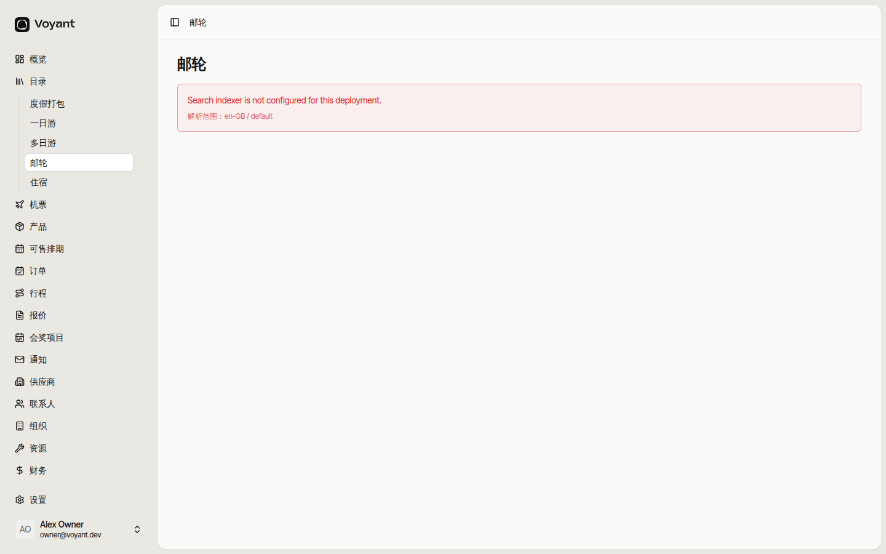
*图:目录中的邮轮页(截图中「索引器未配置」提示为演示环境未开启目录索引所致,不影响邮轮业务操作)。*

1. **建船与舱型**:录入船只(如「东方之星号」)、舱房类别(内舱/海景/阳台/套房)、每类舱位数。
2. **建航次**:航线(长江三峡 4 晚)、出发/返回日期与港口、各舱型价格。航次相当于邮轮版「班期」。

   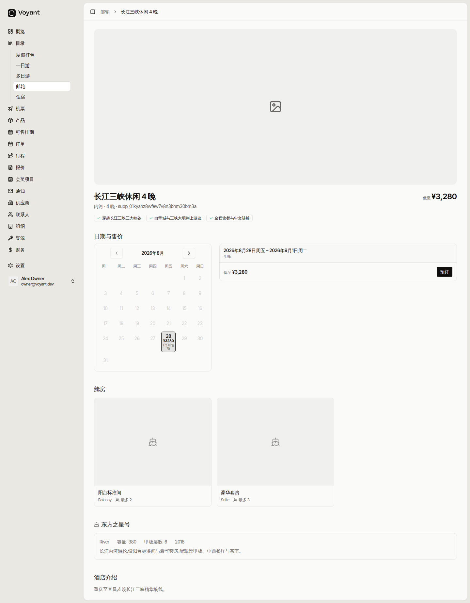
   *图:邮轮详情页(长江三峡/东方之星号),包含舱型与航次日历。*

3. **邮轮延伸(Cruise Extension)**:配置船前/船后酒店或岸上延伸产品,可多个航次共用一套定义;客户选购后随邮轮订单一起管理。
4. **切位**:向船公司包舱时,把拿到的舱位按渠道做**切位**管理,卖多少核销多少。
5. 之后完全复用场景 A 第 4–10 步:客户 → 报价(选航次+舱型+人数)→ 接受 → 订单 → 收款 → 合同 → 凭证 → 售后。

> 你不是船东、只是转售别家航线时,航次以「外采库存(Sourced Inventory)」形式进目录:对客销售体验一样,但库存与确认以上游为准。

---

## 四、场景 C:定制游(FIT 拼装行程)

客户说「我们一家四口,五一去云南 6 天,要两晚洱海海景房」——没有现成产品,就走拼装:

1. 新建报价,在方案里创建**行程需求(Trip Requirement)**:如「大理 2 晚住宿,2 大 2 小,海景」「昆明→大理 交通」——先把需求挂上,不急着定供给。
2. 对每条需求发起**可售搜索**:系统从自营产品与外部货源中返回**候选(Candidate)**清单(带价格与时效)。
3. 与客户沟通后逐条「选定候选」,需求被解决,形成拼装行程(Composed FIT Trip);标记为「必需」的需求不解决,后面无法预留。
4. 发送报价版本 → 客户接受 → 预留:每个组件各自锁位/确认,生成一个**行程封套(Trip Envelope)**下的多个**组件订单**——酒店、机票、包车各有自己的供应商确认、取消规则与凭证,但客户看到的是一份完整行程。
5. 收款、合同、凭证同场景 A;取消时按组件分别处理(机票退改与酒店退改互不牵连)。

---

## 五、场景 D:B2B 分销(渠道卖你的货)

你的产品要给 OTA、同业社、分销 API 卖:

1. **建渠道(Channel)**:分销 → 渠道 → 新建(如「携程分销」「同业-XX旅行社」),类型选 OTA/分销商/API 伙伴。

   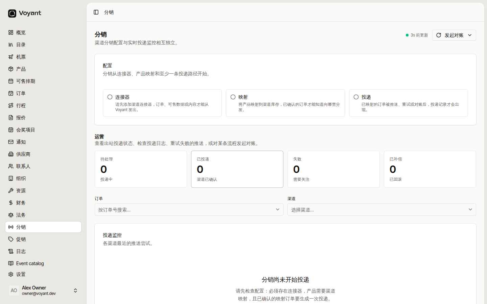
   *图:分销工作台,渠道、切位与对账结算都从这里管理。*

2. **签渠道合同**:录入合作条款,配**佣金规则**:按订单/产品/品类设固定额或百分比。
3. **切位(Allotment)**:把指定产品/班期的一部分库存切给该渠道(如每班期切 10 位)。渠道只能卖自己的切位,卖完为止,直客库存不受影响。
4. **接单**:渠道产生的订单进入你的订单列表,来源标记该渠道。
5. **对账与结算**(每月):
   - 运行**对账(Reconciliation)**:系统比对双方订单与金额,不一致自动生成「对账差异」(缺订单/状态不符/金额不符等),逐条处理;
   - 差异清零后执行**结算(Settle)**,按佣金规则算出应付/应收,出结算单。

---

## 六、场景 E:MICE 会奖(企业包团/会议)

某公司要办 200 人三亚年会:

1. **建项目(Program)**:MICE → 新建项目。挂买方组织、日期区间、预算、负责人。项目是总容器,后续一切都挂在它下面。

   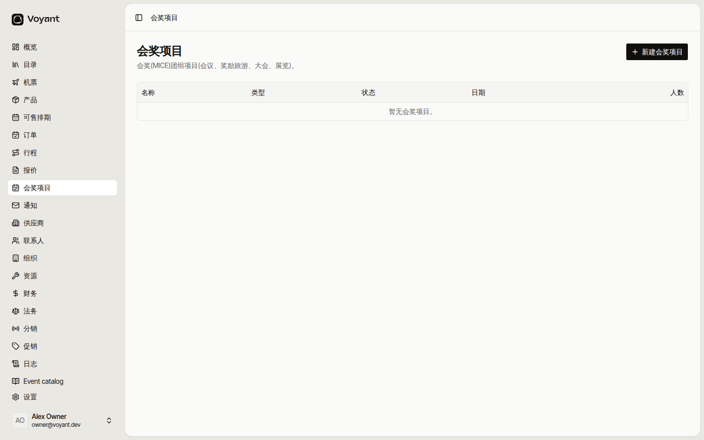
   *图:会奖项目列表(演示环境暂无项目,为空态),从「新建项目」开始。*

2. **录需求(Requirement)**:客房 100 间×3 晚、主会场 1 个(剧院式 250 人)、晚宴、大巴接驳、AV 设备……逐条建「项目需求」。
3. **招标(RFP)**:选中需求打包发起**招标**,发给多家酒店/场地/供应商。
4. **投标(Bid)**:供应商回复报价(分项价格、有效期、附件),系统里逐家登记。
5. **评标 → 授标(Award)**:横向比价、打分,选定中标方并「授标」。落选方通知出局。
6. **锁资源**:按授标结果建**房块(Room Block)**与**场地块(Space Block)**(需求与分配);运营侧用「资源占用(Resource Hold)」锁定执行库存,跟踪 pickup/release(按时释放未用完的房量)。
7. **议程与代表**:建「项目场次」(开幕式/分论坛/晚宴,时间+场地+容量);导入**代表(Delegate)**名单,登记状态,可开自助报名。
8. **商务闭环**:项目下同样走报价 → 订单 → 合同 → 账单 → 收款(可按项目直接开账单)。
9. **执行**:输出运营手册(Run Sheet)、接驳派遣、房单;会后结算多退少补。

---

## 七、场景 F:线上店面(客户自助下单)

如果启用了 storefront 店面:

1. 客户浏览店面 → 选产品与日期(实际就是你的班期与价格的对外投影)→ 提交订单并在线支付。
2. 系统自动:锁位 → 生成订单 → 收款入账 → 发确认函(booking-confirmation-zh 模板)。
3. 你要做的:在订单列表认领新单,补齐旅客信息核验,按场景 A 第 9 步安排履约。
4. 促销:商务模块可发**优惠码(Promotion Code)**(改价,不存钱);售后补偿可发**旅行代金(Travel Credit)**(存钱,凭余额抵扣,有兑换台账)——两者别混用。

   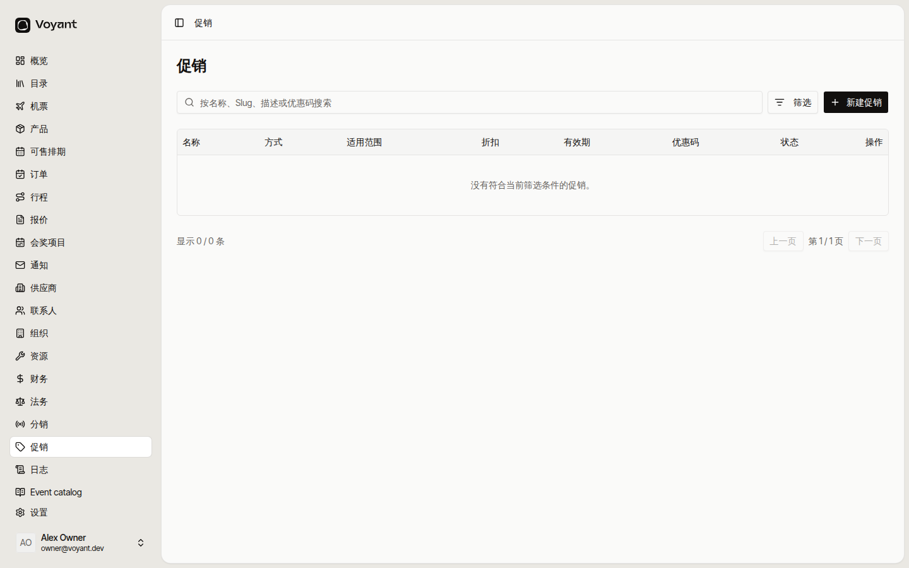
   *图:促销页(演示环境暂无促销活动,为空态),优惠码从这里创建。*

---

## 八、财务人员的一天(速查)

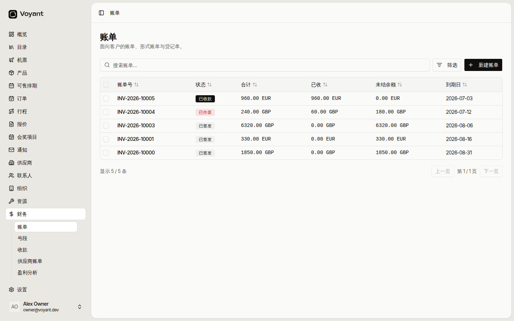
*图:财务模块的账单列表,财务日常工作的主入口。*

| 事项 | 操作 |
| --- | --- |
| 开账单 | 订单/项目 → 生成账单 → 选模板 → 草稿核对 → 发送 |
| 收款入账 | 财务 → 收款 → 新建,勾选对应账单/付款计划行 |
| 退款 | 已收款账单开信用单;未收款账单直接作废 |
| 付供应商 | 财务 → 供应商付款,记录出账 |
| 逾期催收 | 账单列表按「逾期」筛选,逐单跟进 |
| 渠道结算 | 每月对账 → 清差异 → 结算 |
| 汇率 | 多币种报价用汇率组快照,账单币种跟随订单 |

---

## 九、新手最容易踩的 6 个坑

1. **把「客户接受」当成「订单成了」**——接受只是赢单起点,预留成功、组件确认完,订单才算立住。
2. **班期/团期不分**——排库存用班期;带车、导游、房单的固定发团叫团期。
3. **切位/占位/预留混着叫**——切位给渠道,占位属订单,预留会过期。
4. **取消订单时顺手删账单**——账单只能作废(未收款)或开信用单(已收款),财务记录永不删除。
5. **直接改已发送的报价版本**——发出的版本是冻结的,要改就出新版本,历史留痕是保护你。
6. **产品价格里成本、费率、售价乱填**——成本是你付的,费率是供应商报的,售价是客户付的;毛利报表全靠它们分得清。

---

## 十、按角色的最短上手路径

- **销售**:客户建档 → 报价 → 版本发送 → 接受 → 盯预留出订单 →(配合)合同与收款。
- **运营**:建产品 → 定价 → 排班期/关闭 → 出团派遣/资源 → 核销 → 完成订单。
- **财务**:付款计划 → 账单 → 收款 → 退款(信用单/作废)→ 供应商付款 → 渠道对账。
- **管理员**:市场/政策/模板/账号 → 分销渠道与切位 → 看板复盘(概览页)。

> 建议练手顺序:用演示数据把场景 A 完整走一遍(约 30 分钟),再按你的真实业务挑场景 B–F 深入。
